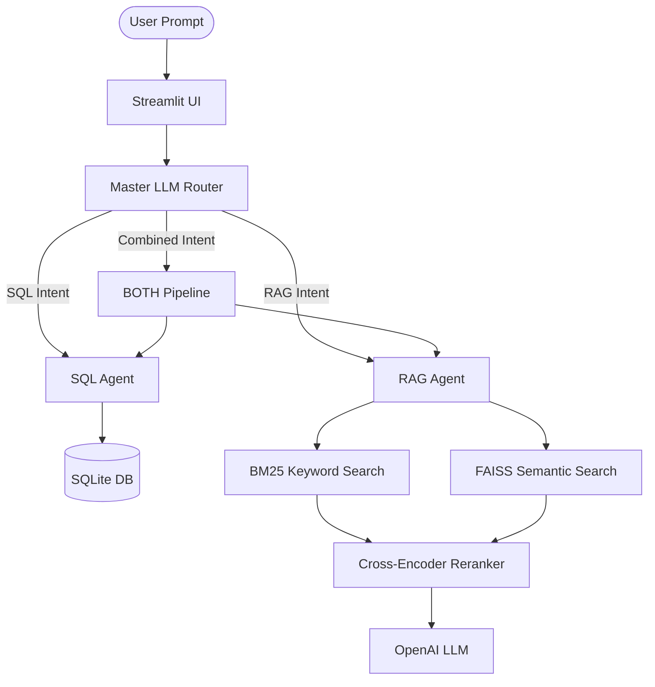

# Multi-Agent AI Assistant (SQL + RAG)

A full-stack, production-ready AI Assistant that intelligently routes user queries between a structured SQL database expert and an unstructured RAG (Retrieval-Augmented Generation) document expert. 

Built with **LangChain**, **Streamlit**, **OpenAI**, and **FAISS**, this system is designed to dynamically decide which data source is needed to answer a user's question, execute the retrieval, and return a synthesized response with exact page citations.

## 🌟 Key Features

- **LLM Master Router**: Uses few-shot prompting to analyze the user's intent and dynamically route the query to either the SQL Agent, the RAG Agent, or a combined "BOTH" routing pipeline.
- **SQL Agent**: Connects to a local SQLite database, automatically inspects the schema, writes syntactically correct SQL queries, executes them, and formats the output into natural language.
- **RAG Agent (with Context Compression)**: Processes unstructured PDFs and Markdown documents. It uses a dual-retrieval system:
  - **FAISS Vector Store**: For dense semantic similarity search.
  - **BM25**: For sparse keyword search.
  - **Cross-Encoder Reranker**: Compresses and reranks the combined results to ensure the LLM only receives the most highly relevant chunks, avoiding token overflow and hallucinations.
- **Dynamic File Uploads**: Users can upload new SQLite databases and PDF/Markdown documents directly through the Streamlit UI. The system automatically ingests and builds the FAISS/BM25 indices on the fly.
- **Conversation Memory**: Maintains a rolling chat history window to allow for conversational follow-up questions.
- **Dockerized**: Fully containerized for easy deployment to cloud platforms like Hugging Face Spaces.

## 🏗️ Architecture



## 🚀 Local Setup

### 1. Prerequisites
- Python 3.10+
- An OpenAI API Key (or an OpenRouter API key)

### 2. Installation
Clone the repository and install the dependencies:
```bash
git clone https://github.com/your-username/sql_agent.git
cd sql_agent
pip install -r requirements.txt
```

### 3. Environment Variables
Create a `.env` file in the root directory and add your API key:
```env
OPENAI_API_KEY=sk-proj-YOUR_API_KEY
# If using OpenRouter, also add:
# OPENAI_API_BASE=https://openrouter.ai/api/v1
```

### 4. Run the Application
```bash
streamlit run app.py
```
The application will be available at `http://localhost:8501`.

## 🐳 Docker Setup

You can run the entire system in a Docker container using the provided `docker-compose.yml`.

```bash
docker-compose up --build
```

## ☁️ Hugging Face Spaces Deployment

This project is configured to run instantly on Hugging Face Spaces as a Docker Template.

1. Create a new Hugging Face Space (Select **Docker** as the Space SDK).
2. Upload the project files directly to the Space.
3. Go to the **Settings** tab in your Space.
4. Under **Variables and secrets**, add a New Secret:
   - Name: `OPENAI_API_KEY`
   - Value: `your-api-key`
5. The container will automatically build and start the Streamlit UI.

*(Note: The `Dockerfile` is already pre-configured to disable Streamlit's XSRF and CORS protections to comply with Hugging Face's reverse proxy requirements).*

## 📁 Project Structure

- `app.py`: The Streamlit web interface and session state manager.
- `multi_agent.py`: The Master Router and the combined "BOTH" routing logic.
- `agent.py`: The SQL Agent implementation.
- `rag_agent.py`: The RAG generation implementation.
- `ingest.py`: Pipeline for loading PDFs and Markdown files.
- `chunking.py`: Logic for splitting documents into overlapping chunks.
- `embeddings.py`: FAISS vector database construction.
- `retriever.py`: BM25 keyword index construction.
- `compressor.py`: Cross-Encoder implementation for reranking documents.
- `Dockerfile` / `docker-compose.yml`: Containerization configuration.
