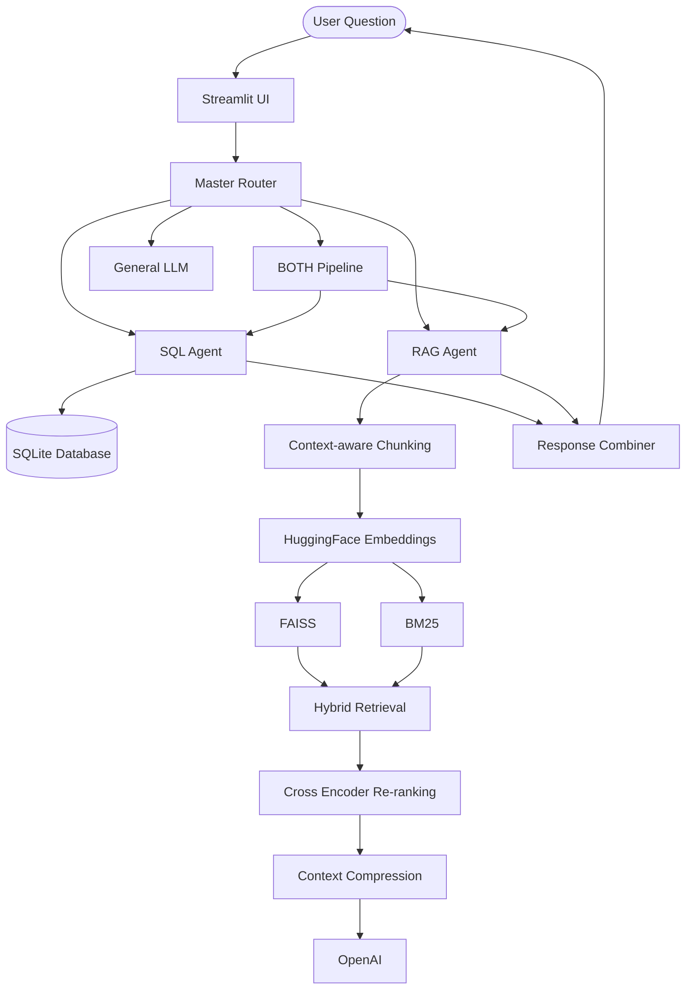

# 🤖 Multi-Agent AI Assistant (SQL + RAG)

A **production-ready Multi-Agent AI Assistant** that intelligently routes user queries between a structured **SQL Database Agent** and an unstructured **RAG (Retrieval-Augmented Generation) Document Agent**.

Built with **LangChain**, **Streamlit**, **OpenAI/OpenRouter**, **FAISS**, and **SQLite**, this system automatically determines which data source is required, retrieves the relevant information, and returns an accurate response with source citations.

---

# 🚀 Live Demo

🔗 **Try the application here:**

https://adee1502-multi-agent-rag-sql-assistant.hf.space

> Upload your own SQLite database and company documents (PDF/Markdown) and start asking questions instantly.

---

# 🌟 Key Features

- 🧠 **LLM Master Router**
  - Uses few-shot prompting to classify user queries into:
    - SQL
    - RAG
    - BOTH
    - General

- 🗄️ **SQL Agent**
  - Connects to SQLite databases
  - Automatically inspects schema
  - Generates SQL queries
  - Executes queries
  - Converts SQL output into natural language

- 📄 **Advanced RAG Agent**
  - Supports PDF, Markdown and TXT documents
  - Context-aware chunking
  - Hybrid Retrieval:
    - FAISS Semantic Search
    - BM25 Keyword Search
  - Cross Encoder Re-ranking
  - Context Compression
  - LLM Answer Generation

- 🔀 **Advanced Multi-Agent Routing**
  - Routes questions to:
    - SQL Agent
    - RAG Agent
    - Both Agents
    - General LLM
  - Sequential orchestration for combined SQL + RAG queries.

- 📂 **Dynamic File Uploads**
  - Upload SQLite databases
  - Upload PDF documents
  - Upload Markdown files
  - Upload Text files
  - Automatic indexing after upload

- 💬 **Conversation Memory**
  - Supports follow-up questions
  - Maintains recent conversation context

- 📚 **Source Citations**
  - Displays document name
  - Displays page number
  - Improves transparency and trust

- 🐳 **Dockerized**
  - Ready for Docker deployment
  - Compatible with Hugging Face Spaces
  - Easily deployable to Render/Railway

---

# 🛠️ Tech Stack

| Category | Technology |
|-----------|------------|
| Frontend | Streamlit |
| Backend | Python |
| LLM Framework | LangChain |
| LLM | GPT-4o-mini / OpenRouter |
| Database | SQLite |
| Vector Store | FAISS |
| Embeddings | HuggingFace Sentence Transformers (all-mpnet-base-v2) |
| Retrieval | FAISS + BM25 Hybrid Retrieval |
| Re-ranking | Cross Encoder (MS MARCO) |
| Context Compression | LangChain Contextual Compression |
| Deployment | Docker, Hugging Face Spaces |

---

# 🏗️ Architecture



---

# 🔄 Combined Query Pipeline

For questions requiring both structured and unstructured data:

```
User Question

↓

Master Router

↓

SQL Agent

↓

Extract Structured Information

↓

Generate Targeted RAG Query

↓

RAG Agent

↓

Combine SQL + RAG Responses

↓

Final Answer
```

---

# 📂 Supported Uploads

### Documents

- PDF
- Markdown (.md)
- Text (.txt)

### Databases

- SQLite (.sqlite)
- SQLite (.db)

---

# 💬 Example Queries

## SQL Agent

- Which customer spent the most?
- What is the total revenue?
- Show the top-selling products.
- Which country generated the highest sales?

---

## RAG Agent

- What is the company's refund policy?
- Where is the European office?
- What benefits do employees receive?
- What is the travel reimbursement policy?

---

## Combined (SQL + RAG)

- Who spent the most money and is the purchased product refundable?
- Which country generated the highest revenue and what is the company's refund policy there?
- What product did Alice purchase and what is the return policy for that product?

---

# 🚀 Local Setup

## 1. Clone Repository

```bash
git clone https://github.com/your-username/sql_agent.git

cd sql_agent
```

---

## 2. Install Dependencies

```bash
pip install -r requirements.txt
```

---

## 3. Configure Environment Variables

Create a `.env` file.

```env
OPENAI_API_KEY=your_api_key

# Optional (OpenRouter)
OPENAI_API_BASE=https://openrouter.ai/api/v1
```

---

## 4. Run the Application

```bash
streamlit run app.py
```

The application will start at `http://localhost:8501`

---

# 🐳 Docker Setup

Build and run the application:

```bash
docker-compose up --build
```

The application will be available at `http://localhost:8501`

---

# ☁️ Hugging Face Spaces Deployment

This project is fully compatible with Hugging Face Spaces.

### Steps

1. Create a new Hugging Face Space.
2. Select **Docker** as the SDK.
3. Upload the repository.
4. Go to **Settings → Variables and Secrets**.
5. Add `OPENAI_API_KEY` with your API key. (And `OPENAI_API_BASE` if using OpenRouter).

The Docker container will automatically build and launch the Streamlit application.

---

# 📁 Project Structure

```
project/

│
├── app.py                  # Streamlit UI
├── multi_agent.py          # Master Router
├── agent.py                # SQL Agent
├── rag_agent.py            # RAG Agent
│
├── ingest.py               # Document ingestion
├── chunking.py             # Context-aware chunking
├── embeddings.py           # Embeddings Model
├── retriever.py            # Hybrid retrieval
├── reranker.py             # Cross Encoder
├── compressor.py           # Context compression
│
├── documents/              # Uploaded documents
├── data/                   # SQLite databases
├── vectorstore/            # FAISS indices
│
├── evaluator.py            # RAGAS evaluation
├── test_retrieval.py       # Retrieval testing script
├── metadata.yml            # System metadata
├── task.md                 # Developer task list
│
├── Dockerfile
├── docker-compose.yml
├── requirements.txt
└── README.md
```

---

# ⚡ Production Features

- ✅ Intelligent Multi-Agent Routing
- ✅ SQL Query Agent
- ✅ Advanced RAG Pipeline
- ✅ Context-aware Chunking
- ✅ Hybrid Retrieval
- ✅ Cross Encoder Re-ranking
- ✅ Context Compression
- ✅ Conversation Memory
- ✅ Source Citations
- ✅ Dynamic File Uploads
- ✅ Dockerized Deployment
- ✅ Hugging Face Spaces Ready

---

# 🔮 Future Improvements

- Model Context Protocol (MCP) Integration
- Authentication & User Accounts
- PostgreSQL / MySQL Support
- Cloud Vector Databases (Pinecone/Qdrant)
- OCR Support for Scanned PDFs
- Multi-modal Document Understanding
- Multi-user Workspace Support

---

# 📄 License

This project is licensed under the **MIT License**.

---

# ⭐ If you found this project useful, consider giving it a Star!

It helps others discover the project and motivates future improvements.
